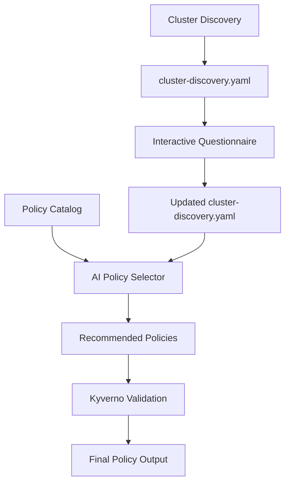

# AEGIS - AI Enabled Governance Insights & Suggestions

[](https://python.org)
[](LICENSE)
[](#testing)

AEGIS is a comprehensive CLI tool that automates Kubernetes cluster governance by combining intelligent cluster discovery, interactive requirement gathering, policy catalog management, and AI-powered policy selection and customization.

Named after the protective shield in Greek mythology, AEGIS aligns with Kyverno's mission to secure Kubernetes workloads through intelligent policy recommendation and validation.

## 🚀 Features

- **🔍 Automated Cluster Discovery**: Comprehensive cluster analysis including third-party controllers and managed service detection
- **❓ Interactive Requirements Gathering**: Targeted questionnaire system with 19 governance-focused questions
- **📚 Policy Catalog Management**: Automated policy catalog creation from GitHub repositories with 350+ policies
- **🤖 AI-Powered Policy Selection**: AWS Bedrock integration with Two-Phase selection for intelligent policy recommendation
- **✅ Policy Validation**: Automated Kyverno policy testing, validation, and test case generation
- **📊 Comprehensive Reporting**: Detailed validation reports and deployment guides

## 📦 Installation

### Prerequisites

- Python 3.8 or higher
- Kubernetes cluster access (kubectl configured)
- AWS credentials (for Bedrock integration)
- Kyverno CLI (optional, for policy validation)

### Install from Source

```bash
# Clone the repository
git clone https://github.com/your-org/aegis.git
cd aegis

# Create virtual environment
python -m venv venv
source venv/bin/activate  # On Windows: venv\Scripts\activate

# Install dependencies
pip install -r requirements.txt

# Install AEGIS in development mode
pip install -e .
```

### Install Kyverno CLI (Optional)

For policy validation features:

```bash
# Install Kyverno CLI
curl -LO https://github.com/kyverno/kyverno/releases/download/v1.15.0/kyverno-cli_v1.15.0_linux_x86_64.tar.gz
tar -xzf kyverno-cli_v1.15.0_linux_x86_64.tar.gz
sudo mv kyverno /usr/local/bin/
```

## 🚀 Quick Start

### 1. Initialize Configuration

```bash
# Create default configuration file
python main.py config --init

# Edit configuration as needed
nano aegis-config.yaml
```

### 2. Run Complete Workflow

```bash
# Execute all steps in sequence
python main.py run --all
```

### 3. Or Run Individual Commands

```bash
# Step 1: Discover cluster information
python main.py discover --output cluster-discovery.yaml

# Step 2: Gather governance requirements
python main.py questionnaire --input cluster-discovery.yaml

# Step 3: Build policy catalog (one-time setup)
python main.py catalog --repos https://github.com/kyverno/policies

# Step 4: Get AI policy recommendations
python main.py recommend --input cluster-discovery.yaml --output ./recommended-policies

# Step 5: Validate policies (optional)
python main.py validate --directory ./recommended-policies --fix
```

## ⚙️ Configuration

AEGIS uses YAML configuration files. Configuration is loaded from:
1. `./aegis-config.yaml` (current directory)
2. `~/.aegis/config.yaml` (user home)
3. `/etc/aegis/config.yaml` (system-wide)

### Complete Configuration Example

```yaml
# Cluster connection settings
cluster:
  kubeconfig_path: ~/.kube/config
  context: my-cluster-context
  timeout: 60

# Questionnaire settings
questionnaire:
  total_questions: 19

# Policy catalog settings
catalog:
  local_storage: ./policy-catalog
  index_file: ./policy-catalog/policy-index.json
  repositories:
  - url: https://github.com/kyverno/policies
    branch: main

# AI configuration
ai:
  provider: aws-bedrock
  model: amazon.nova-pro-v1:0
  region: us-east-1
  max_tokens: 4000
  temperature: 0.1
  
  # Policy selection settings
  policy_count:
    total_target: 20
  
  # Two-Phase selection (recommended for large catalogs)
  two_phase_selection:
    enabled: true
    phase_one_candidates: 150
    phase_one_max_tokens: 2000
    phase_two_max_tokens: 4000
  
  # Error handling and fallbacks
  error_handling:
    enable_fallbacks: true
    max_retry_attempts: 3
    fallback_models:
    - anthropic.claude-3-haiku-20240307-v1:0
    - amazon.nova-lite-v1:0
    emergency_selection: true

# Output settings
output:
  directory: ./recommended-policies
  dynamic_categories: true
  include_tests: true
  validate_policies: false

# Logging configuration
logging:
  level: INFO
  file: ./aegis.log
```

## 📖 Detailed Usage

### Cluster Discovery

Automatically discover comprehensive cluster information:

```bash
# Basic discovery
python main.py discover

# Specify output file and cluster context
python main.py discover --output my-cluster.yaml --context production-cluster

# Discovery with custom timeout
python main.py discover --timeout 120
```

**Discovery Output Includes:**
- Kubernetes version and node information
- Managed service detection (EKS, AKS, GKE)
- Third-party controllers (Istio, ArgoCD, NGINX Ingress, etc.)
- Security features (RBAC, Pod Security Standards)
- Resource counts and cluster metadata

### Interactive Questionnaire

Gather governance requirements through targeted questions:

```bash
# Run interactive questionnaire
python main.py questionnaire --input cluster-discovery.yaml

# Batch mode with defaults (for automation)
python main.py questionnaire --input cluster-discovery.yaml --batch
```

**Questionnaire Features:**
- 19 carefully crafted governance questions
- Follow-up questions for registries and compliance frameworks
- Automatic appending to cluster discovery file
- Category-based organization

### Policy Catalog Management

Build and maintain policy catalogs from GitHub repositories:

```bash
# Create catalog from Kyverno policies repository
python main.py catalog --repos https://github.com/kyverno/policies

# Multiple repositories
python main.py catalog --repos "https://github.com/kyverno/policies,https://github.com/nirmata/kyverno-policies"

# Refresh existing catalog
python main.py catalog --repos https://github.com/kyverno/policies --refresh

# Custom output directory
python main.py catalog --repos https://github.com/kyverno/policies --output ./my-catalog
```

### AI Policy Recommendation

Get intelligent policy recommendations using AWS Bedrock:

```bash
# Basic recommendation
python main.py recommend --input cluster-discovery.yaml

# Custom policy count and output
python main.py recommend --input cluster-discovery.yaml --count 25 --output ./policies

# Enable validation and automatic fixing
python main.py recommend --input cluster-discovery.yaml --fix

# Use specific AI model
python main.py recommend --input cluster-discovery.yaml --ai-model amazon.nova-pro-v1:0

# Disable AI (use rule-based selection)
python main.py recommend --input cluster-discovery.yaml --no-ai
```

**AI Features:**
- Two-Phase selection for handling large policy catalogs (350+ policies)
- Intelligent policy customization based on cluster requirements
- Automatic test case generation for policies missing tests
- Dynamic category organization
- Comprehensive error handling with fallback models

### Policy Validation

Validate policies using Kyverno CLI:

```bash
# Basic validation
python main.py validate --directory ./recommended-policies

# Validation with automatic fixing
python main.py validate --directory ./recommended-policies --fix

# Custom policies directory
python main.py validate --directory ./my-policies
```

**Validation Features:**
- Automated Kyverno test execution
- Test case generation for policies missing tests
- AI-powered fixing of malformed test files
- Comprehensive validation reports in YAML format
- Support for both basic and advanced validation modes

## 🏗️ Architecture

AEGIS follows a modular architecture with four main components:

### 1. Cluster Discovery Engine (`discovery/`)
- **Purpose**: Automated cluster analysis and information gathering
- **Key Files**: `discovery.py`, `cluster_analyzer.py`
- **Features**: Kubernetes API integration, managed service detection, third-party controller scanning

### 2. Interactive Questionnaire System (`questionnaire/`)
- **Purpose**: Governance requirements gathering through targeted questions
- **Key Files**: `questionnaire_runner.py`, `question_bank.py`, `yaml_updater.py`
- **Features**: 19 governance questions, follow-up logic, YAML integration

### 3. Policy Catalog Manager (`catalog/`)
- **Purpose**: GitHub repository processing and policy indexing
- **Key Files**: `catalog_manager.py`, `github_processor.py`, `policy_indexer.py`
- **Features**: Git repository cloning, policy parsing, lightweight indexing

### 4. AI Policy Selector (`ai/`)
- **Purpose**: Intelligent policy selection and customization using AWS Bedrock
- **Key Files**: `ai_policy_selector.py`, `bedrock_client.py`, `kyverno_validator.py`
- **Features**: Two-Phase selection, policy customization, validation, test generation

### Data Flow



## 🧪 Testing

AEGIS includes comprehensive test coverage with unit tests, integration tests, and external service tests.

### Running Tests

```bash
# Run all tests
python -m pytest tests/ -v

# Run unit tests only
python -m pytest tests/test_*.py -v

# Run integration tests
python -m pytest tests/integration/ -v

# Run with coverage
python -m pytest tests/ --cov=. --cov-report=html

# Run specific test file
python -m pytest tests/test_ai_selector.py -v
```

### Test Structure

```
tests/
├── fixtures/                    # Test data and sample policies
│   ├── sample_policies.py      # Policy fixtures and templates
│   └── __init__.py
├── integration/                 # Integration tests
│   ├── test_end_to_end.py      # Complete workflow tests
│   └── test_external_services.py # External API tests
├── test_ai_selector.py         # AI policy selector tests
├── test_bedrock_client.py      # AWS Bedrock client tests
├── test_catalog.py             # Policy catalog tests
├── test_config.py              # Configuration tests
├── test_discovery.py           # Cluster discovery tests
├── test_kyverno_validator.py   # Kyverno validation tests
├── test_output_manager.py      # Output management tests
└── test_questionnaire.py       # Questionnaire tests
```

### Test Categories

- **Unit Tests**: Test individual components with mocked dependencies
- **Integration Tests**: Test component interactions and workflows
- **External Service Tests**: Test real API interactions (requires credentials)

## 🔧 Development

### Setting Up Development Environment

```bash
# Clone repository
git clone https://github.com/your-org/aegis.git
cd aegis

# Create virtual environment
python -m venv venv
source venv/bin/activate

# Install development dependencies
pip install -r requirements.txt
pip install -e .

# Install pre-commit hooks (optional)
pip install pre-commit
pre-commit install
```

### Code Quality

```bash
# Format code
black .

# Lint code
flake8 .

# Type checking
mypy .

# Run all quality checks
python -m pytest tests/ --cov=. && black --check . && flake8 . && mypy .
```

### Adding New Components

1. **Create module files** in appropriate directory (`ai/`, `catalog/`, `discovery/`, `questionnaire/`)
2. **Add data models** to `models.py` if needed
3. **Create unit tests** in `tests/test_<component>.py`
4. **Update configuration** in `config.py` and `aegis-config.yaml`
5. **Add CLI commands** in `cli/commands.py`
6. **Update documentation** in README.md

## 🤝 Contributing

We welcome contributions! Please follow these guidelines:

### Contribution Process

1. **Fork the repository** and create a feature branch
2. **Make your changes** following the coding standards
3. **Add tests** for new functionality
4. **Update documentation** as needed
5. **Submit a pull request** with a clear description

### Coding Standards

- Follow PEP 8 style guidelines
- Use type hints for function signatures
- Add docstrings for all public functions and classes
- Maintain test coverage above 80%
- Use meaningful variable and function names

### Pull Request Guidelines

- Include a clear description of changes
- Reference any related issues
- Ensure all tests pass
- Update documentation if needed
- Add changelog entry for significant changes

## 📝 Changelog

### Version 1.0.0 (Current)

- ✅ Complete cluster discovery engine
- ✅ Interactive questionnaire system (19 questions)
- ✅ Policy catalog management with GitHub integration
- ✅ AI-powered policy selection with Two-Phase approach
- ✅ Kyverno policy validation and test generation
- ✅ Comprehensive test coverage
- ✅ CLI interface with all commands
- ✅ Configuration management system
- ✅ Error handling and fallback mechanisms

## 🆘 Troubleshooting

### Common Issues

#### AWS Bedrock Access Issues
```bash
# Check AWS credentials
aws sts get-caller-identity

# Verify Bedrock model access
aws bedrock list-foundation-models --region us-east-1
```

#### Kubernetes Connection Issues
```bash
# Check cluster access
kubectl cluster-info

# Verify context
kubectl config current-context

# Test with specific context
python main.py discover --context my-cluster
```

#### Kyverno CLI Issues
```bash
# Check Kyverno CLI installation
kyverno version

# Install if missing
curl -LO https://github.com/kyverno/kyverno/releases/latest/download/kyverno-cli_linux_x86_64.tar.gz
```

### Debug Mode

Enable debug logging for troubleshooting:

```yaml
# In aegis-config.yaml
logging:
  level: DEBUG
  file: ./aegis-debug.log
```

### Getting Help

- 📖 Check this README for detailed usage instructions
- 🐛 Report bugs via GitHub Issues
- 💬 Ask questions in GitHub Discussions
- 📧 Contact maintainers for security issues

## 📄 License

This project is licensed under the MIT License - see the [LICENSE](LICENSE) file for details.

## 🙏 Acknowledgments

- **Kyverno Community** for the comprehensive policy library
- **AWS Bedrock** for AI/ML capabilities
- **Kubernetes Community** for the robust API ecosystem
- **Contributors** who help improve AEGIS

---

**AEGIS** - Protecting your Kubernetes workloads with intelligent governance 🛡️